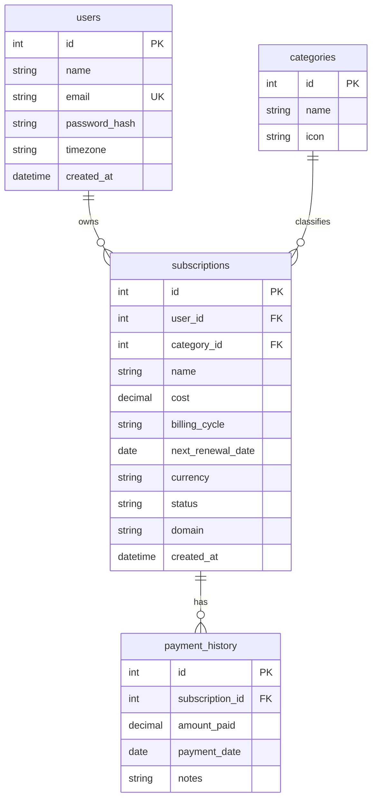

# Subscription Tracker

> A full-stack subscription management app with analytics, renewal reminders, AI-assisted subscription entry, dark mode, and PostgreSQL trigger-based payment history.


## Overview

Subscription Tracker helps users manage recurring payments in one place. Users can add subscriptions, track renewal dates, view spending analytics, inspect upcoming renewals on a calendar, and use an AI-guided assistant to add subscriptions through chat.

The project is also designed as a DBMS-focused academic project. It includes a normalized PostgreSQL schema, foreign key relationships, protected CRUD operations, analytics queries, and a database trigger that automatically creates payment history whenever a subscription is inserted.

## Key Features

- JWT-based authentication with bcrypt password hashing.
- Google OAuth login with explicit Gmail read-only consent for demo users.
- Full CRUD for subscriptions.
- Positive amount validation for subscription cost.
- Category-based subscription organization.
- Logo support using service domain names.
- Dashboard with spending summary and upcoming renewals.
- Notification bell for renewal reminders due in the next 7 days.
- Renewal timeline calendar with hover logo previews.
- Analytics page with animated graphs and hollow pie chart.
- AI chat flow for adding subscriptions by asking missing details.
- Gmail API scanner that searches only likely subscription emails and stores extracted subscription details.
- Light and dark mode using CSS variables.
- PostgreSQL trigger for automatic payment history creation.

## Tech Stack

| Area | Tools |
| --- | --- |
| Frontend | React, Vite, React Router |
| Styling | CSS variables, responsive inline styles |
| Animation | Framer Motion |
| Charts | Recharts |
| API Client | Axios |
| Backend | Node.js, Express.js |
| Authentication | JWT, bcryptjs |
| Google APIs | OAuth 2.0, Gmail API read-only scope |
| Database | PostgreSQL / Supabase |
| ORM | Prisma |
| AI | OpenRouter-compatible API |

## Architecture

```text
React Frontend
  |
  | Axios requests with JWT token
  v
Express REST API
  |
  | Protected routes + controllers
  v
Prisma ORM
  |
  v
PostgreSQL / Supabase
  |
  | AFTER INSERT trigger
  v
payment_history auto-created
```

## Screenshots

Add your screenshots in this section before pushing, for example:

```md


```

## Project Structure

```text
subscription-tracker/
  backend/
    prisma/
      schema.prisma
      sql/
        create_payment_history_trigger.sql
    src/
      app.js
      config/
        db.js
      controllers/
        ai.controller.js
        analytics.controller.js
        auth.controller.js
        subscription.controller.js
      middleware/
        auth.middleware.js
      routes/
        ai.routes.js
        analytics.routes.js
        auth.routes.js
        subscription.routes.js
      services/
        ai.service.js

  frontend/
    src/
      App.jsx
      main.jsx
      index.css
      components/
        Navbar.jsx
      context/
        AuthContext.jsx
        ThemeContext.jsx
      pages/
        Analytics.jsx
        Dashboard.jsx
        Login.jsx
        Register.jsx
        RenewalTimeline.jsx
        Subscriptions.jsx
      services/
        api.js
```

## Database Design

The database uses a normalized relational design with four main entities:

- `users`: stores account information and password hash.
- `categories`: stores subscription categories such as OTT, Music, SaaS, Gaming, Fitness, News, and Other.
- `subscriptions`: stores recurring subscription details.
- `payment_history`: stores payment records for subscriptions.



## DBMS Trigger

This project includes a PostgreSQL trigger to demonstrate database-level automation.

File:

```text
backend/prisma/sql/create_payment_history_trigger.sql
```

Purpose:

When a new subscription is inserted into `subscriptions`, PostgreSQL automatically inserts an initial row into `payment_history`.

```sql
CREATE TRIGGER trg_create_initial_payment_history
AFTER INSERT ON subscriptions
FOR EACH ROW
EXECUTE FUNCTION create_initial_payment_history();
```

Why this matters:

- Keeps payment history consistent.
- Avoids duplicate backend logic.
- Works even if data is inserted outside the app.
- Demonstrates triggers, foreign keys, and database automation.

## Gmail Subscription Scanner

Google Sign-In alone does not allow Gmail access. This project uses a separate Google OAuth consent flow with the Gmail read-only scope:

```text
https://www.googleapis.com/auth/gmail.readonly
```

The scanner is intended only for college/demo testing users. It does not fetch every email. It uses a focused Gmail search query for likely subscription messages, for example subscription, invoice, receipt, billing, payment, membership, renewal, and no-reply senders. The scan limit is controlled by `GMAIL_SCAN_LIMIT`.

Privacy approach:

- Do not store full email bodies.
- Store only extracted subscription metadata.
- Search likely subscription-related emails only.
- Keep the app in Google OAuth testing mode for demo use.
- Production use would require Google verification and restricted-scope compliance.

## API Overview

### Auth

| Method | Endpoint | Description |
| --- | --- | --- |
| POST | `/api/auth/register` | Create user account |
| POST | `/api/auth/login` | Login and receive JWT |

### Subscriptions

| Method | Endpoint | Description |
| --- | --- | --- |
| GET | `/api/subscriptions` | Get logged-in user's subscriptions |
| POST | `/api/subscriptions` | Create subscription |
| GET | `/api/subscriptions/:id` | Get one subscription |
| PUT | `/api/subscriptions/:id` | Update subscription |
| DELETE | `/api/subscriptions/:id` | Delete subscription |

### Analytics

| Method | Endpoint | Description |
| --- | --- | --- |
| GET | `/api/analytics/summary` | Monthly/yearly spend summary |
| GET | `/api/analytics/by-category` | Category-wise spending |
| GET | `/api/analytics/upcoming-renewals` | Renewals due in next 7 days |
| GET | `/api/analytics/yearly` | Month-wise yearly breakdown |

### AI

| Method | Endpoint | Description |
| --- | --- | --- |
| POST | `/api/ai/analyze` | Generate spending insights |
| POST | `/api/ai/parse-subscription` | Parse subscription text |
| POST | `/api/ai/chat` | Chat with finance assistant |

## Getting Started

### Prerequisites

- Node.js
- npm
- PostgreSQL database or Supabase project

### 1. Clone The Repository

```bash
git clone https://github.com/your-username/subscription-tracker.git
cd subscription-tracker
```

### 2. Backend Setup

```bash
cd backend
npm install
```

Create `backend/.env`:

```env
DATABASE_URL="your_postgresql_connection_url"
DIRECT_URL="your_direct_postgresql_connection_url"
JWT_SECRET="your_jwt_secret"
OPENROUTER_API_KEY="your_openrouter_api_key"
GOOGLE_CLIENT_ID="your_google_oauth_client_id"
GOOGLE_CLIENT_SECRET="your_google_oauth_client_secret"
GOOGLE_REDIRECT_URI="http://localhost:5000/api/auth/google/callback"
FRONTEND_URL="http://localhost:5173"
SESSION_SECRET="your_token_encryption_secret"
GMAIL_SCAN_LIMIT=150
PORT=5000
```

Push the Prisma schema:

```bash
npx prisma db push
```

Run the trigger SQL in Supabase SQL Editor or your PostgreSQL client:

```text
backend/prisma/sql/create_payment_history_trigger.sql
```

Start the backend:

```bash
npm run dev
```

Backend runs on:

```text
http://localhost:5000
```

Health check:

```text
http://localhost:5000/ping
```

Expected response:

```json
{"status":"alive"}
```

### 3. Frontend Setup

Open a second terminal:

```bash
cd frontend
npm install
npm run dev
```

Frontend runs on:

```text
http://127.0.0.1:5173
```

If your backend URL is different, create a frontend environment variable:

```env
VITE_API_URL="http://localhost:5000/api"
```

## Verification

Frontend lint:

```bash
cd frontend
npm run lint
```

Frontend production build:

```bash
cd frontend
npm run build
```

Backend syntax check example:

```bash
cd backend
node --check src/app.js
```

## Core Workflows

### Add Subscription

```text
User submits form
  -> frontend sends POST /api/subscriptions
  -> JWT middleware verifies user
  -> backend validates positive cost
  -> Prisma inserts subscription
  -> PostgreSQL trigger creates payment_history row
```

### Analytics

```text
Frontend requests analytics
  -> backend fetches active subscriptions
  -> costs are normalized monthly
  -> response is visualized with charts
```

Monthly cost normalization:

- Monthly: `cost`
- Yearly: `cost / 12`
- Weekly: `cost * 4`

### AI Subscription Add

```text
User opens AI chat
  -> user enters partial subscription details
  -> parser extracts available fields
  -> chat asks for missing fields
  -> user reviews live preview
  -> subscription is saved
```

## Security Highlights

- Passwords are hashed with bcrypt.
- JWT tokens protect private routes.
- Backend reads `req.userId` from verified token.
- Subscription queries are scoped to the logged-in user.
- Cost validation prevents invalid negative or zero subscription amounts.

## DBMS Concepts Demonstrated

- Relational schema design.
- Primary keys and foreign keys.
- One-to-many relationships.
- Normalization.
- Trigger-based automation.
- CRUD operations.
- Aggregation for analytics.
- Cascade delete from subscriptions to payment history.
- User-level data isolation.

## Future Improvements

- Real email reminders before renewal dates.
- Persistent `renewal_reminders` database table.
- Audit log trigger for subscription updates and deletes.
- Database views for reporting.
- Indexes for faster renewal and analytics queries.
- Export analytics report as PDF.
- Budget alerts and spending limits.
- More advanced AI recommendations.

## Short Project Summary

Subscription Tracker is a full-stack subscription management system built with React, Express, Prisma, and PostgreSQL. It lets users manage recurring subscriptions, view analytics, track renewals, and add subscriptions using an AI-guided assistant. The project also includes a PostgreSQL trigger that automatically creates payment history records, making it suitable as both a practical web app and a DBMS project.
